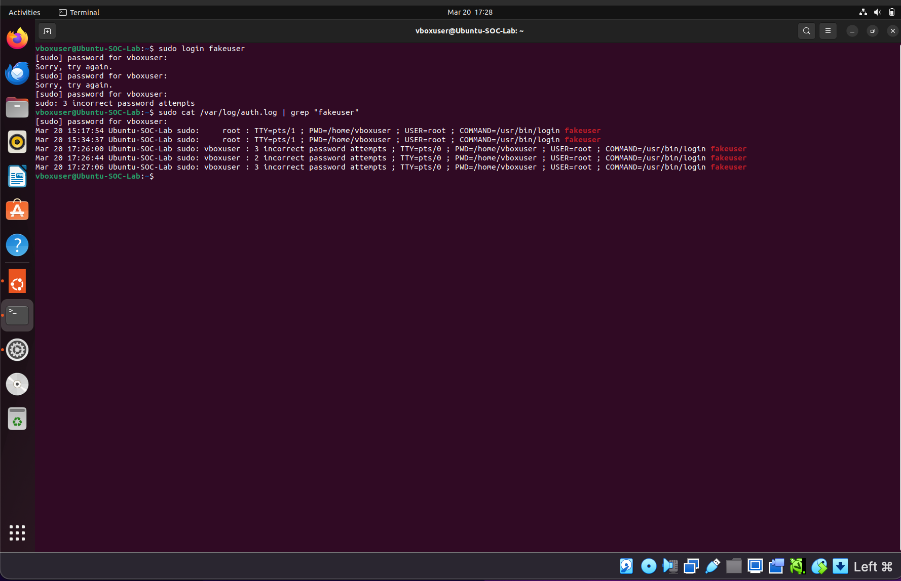
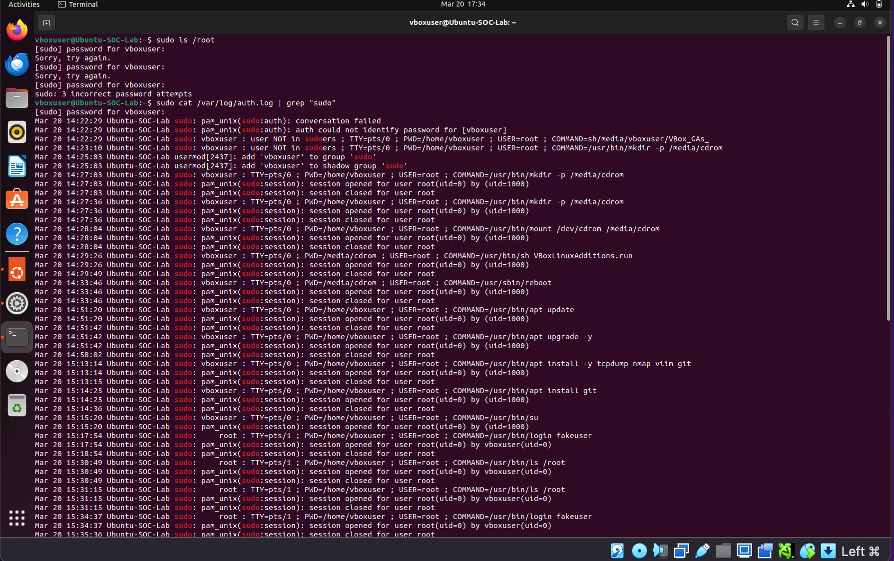
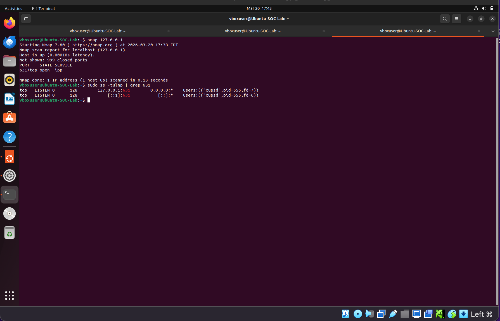
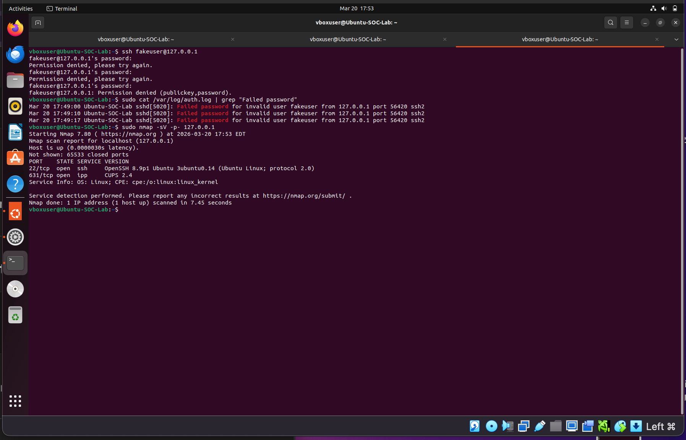
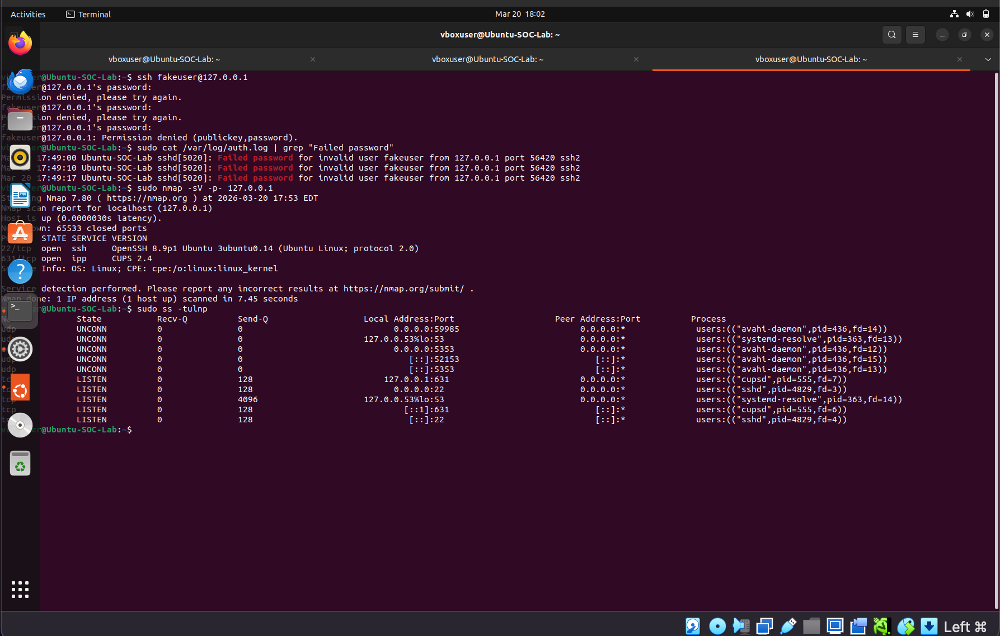
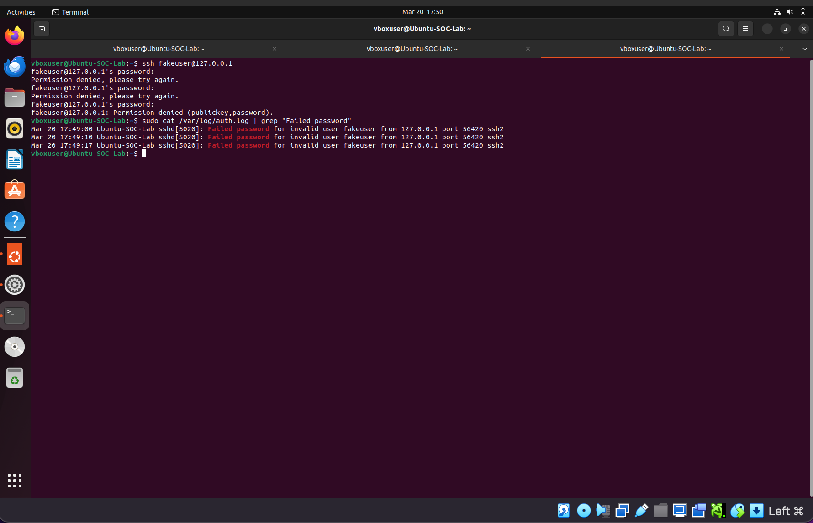
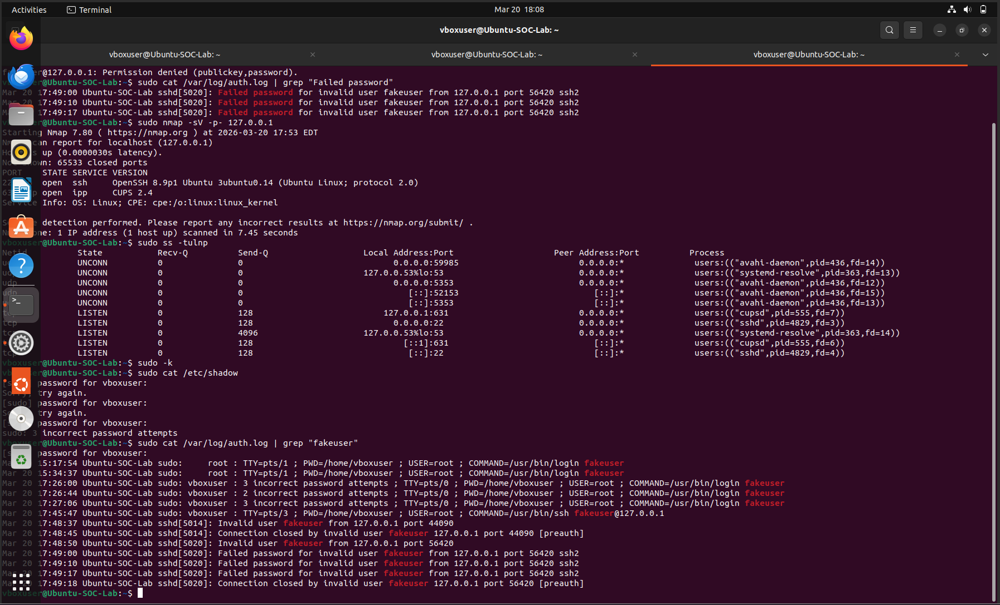
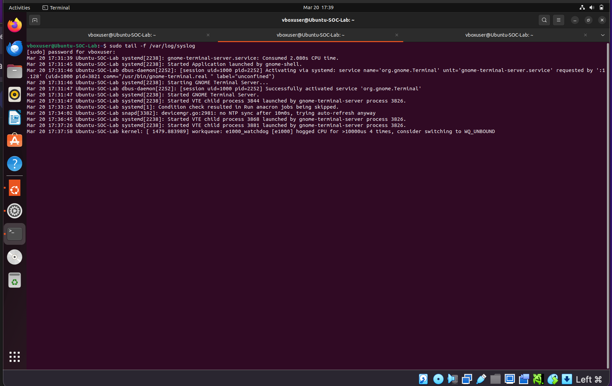

# SOC-Lab-Project
## Overview
This project demonstrates a basic SOC lab built using an Ubuntu virtual machine in VirtualBox.
The goal was to simulate common security events and analyze system and authentication logs.

## Lab Environment
- Platform: VirtualBox
- Operating System: Ubuntu Linux
- User Account: vboxuser
- Tools Used: Nmap, tcpdump, and Linux system logs 

## Simulated Security Events

### 1. Failed Login Attempt
A failed login was simulated using a non-existent user:
sudo login fakeuser
Result:
- Multiple incorrect login attempts recorded
- Authentication failures logged in /var/log/auth.log

### 2. Failed Sudo (Privilege Escalation Attempt)
Failed privilege escalation was simulated by entering incorrect passwords for vboxuser using sudo commands:
sudo ls /root
Result:
- Multiple incorrect sudo attempts logged
- Shows PAM authentication failures for privilege escalation attempts

### 3. Basic Nmap Scan
A local network scan was performed to identify open ports:
nmap 127.0.0.1
Result:
- Port 631/tcp found open (IPP - printing service)

### 4. Full Port Scan with Service Detection
A full TCP port scan with service version detection:
sudo nmap -sV -p- 127.0.0.1
Result:
- Enumerated all ports and identified running services
- Confirmed exposed services on the host

### 5. Viewing Active Services and Processes
To view listening ports and processes using ss:
sudo ss -tulnp
Result:
- Displayed active processes and their bound ports
- Provided insight into system services and network exposure

### 6. SSH Failed Login Attempts
Simulated SSH login failures were generated:
Invalid user login attempts
Multiple failed password attempts
Result:
- Logged as "Failed password for invalid user"
- Source IP: 127.0.0.1

### 7. Correlated Security Events
Multiple events combined for analysis:
- Network scanning
- Open port discovery
- Running services
- Authentication failures
Result:
- Demonstrates multiple security events (authentication failures, scanning, and service enumeration) that can be analyzed together.

### 8. System Log Snapshot
A snapshot of the system logs (syslog) was taken:
cat /var/log/syslog
Result:
- Displays general system activity and messages
- Useful for detecting anomalies and system events

## Key Takeaways
- Authentication logs are critical for detecting failed login and privilege escalation attempts
- Network scanning helps identify exposed services and potential attack surfaces
- System tools like ss provide visibility into active processes and ports
- SOC analysis often involves correlating multiple events across different logs

## Conclusion
This project demonstrates foundational SOC skills, including:
- Log analysis
- Threat simulation
- Network enumeration
- Event correlation
